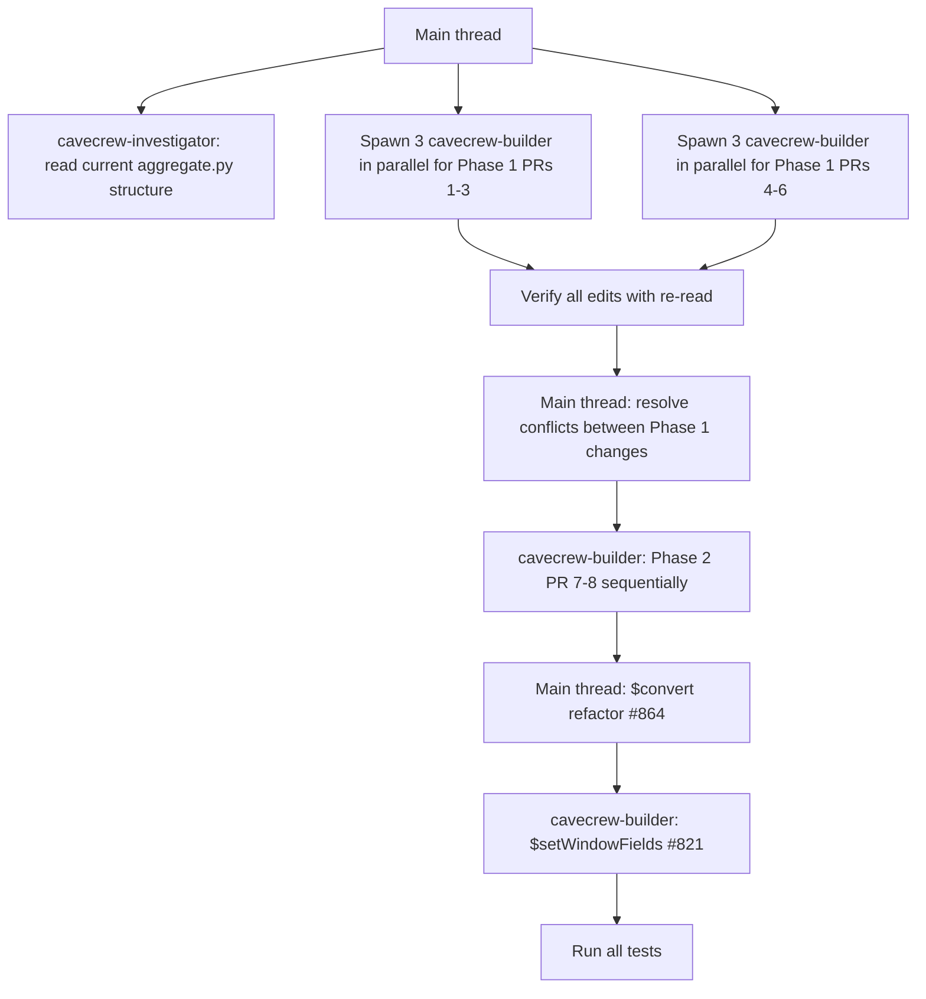

# Aggregation PR Consolidation — Execution Prompt

Use this prompt in a new opencode session to apply all 10 aggregation PRs into one branch.

## Load skills
Load `pr-coder` and `cavecrew` skills at session start.

## Overview
Consolidate 10 mongomock PRs into single PR `pr/aggregation-consolidated` targeting `develop`. All PRs are unimplemented in mongomock-ng (verified v7.0.3). Branch from `develop`.

## PRs to apply (apply in this order)

### Phase 1 — Simple (parallel via cavecrew-builder)
1. **#822** — timezone `$expression` support.
   - `aggregate.py:625`: change `values['timezone']` → `self.parse(values['timezone'])`
   - `aggregate.py:622`: add `tz = self.parse(values['timezone'])` before `target_tz = pytz.timezone(tz)`
   - Add test `test_aggregate_date_with_timezone_expression` to `test__mongomock.py` (comparison test)

2. **#930** — `$round` with `<place>` param.
   - Add `binary_arithmetic_operators_with_optional_second_number = {'$round'}` near line 77
   - Add `'$round'` to `unary_arithmetic_operators` and `binary_arithmetic_operators`
   - In `_handle_arithmetic_operator`: add `$round` case with `round(number_0, number_1)`
   - Add tests to `test__mongomock.py`

3. **#935** — `$toObjectId` operator.
   - Add `'$toObjectId'` to `type_convertion_operators` list (line 180)
   - Add handler in `_handle_type_convertion_operator` before `$arrayToObject`
   - Add tests to `test__collection_api.py`

4. **#896** — `$sortByCount` stage.
   - Add `_handle_sort_by_count_stage()` function
   - Register in `_PIPELINE_HANDLERS`: `'$sortByCount': _handle_sort_by_count_stage`
   - Add comparison tests to `test__mongomock.py`

5. **#892** — `$fill` stage.
   - Add `_handle_fill()` function
   - Register in `_PIPELINE_HANDLERS`: `'$fill': _handle_fill`
   - Add tests to `test__collection_api.py`

6. **#929** — `$type` aggregation operator (+date).
   - Add `'$type'` to `type_operators` list
   - Add handler in `_handle_type_operator` (handles: bool→"bool", str→"string", dict→"object", list/tuple→"array", None→"null", int>2^31-1→"long", int→"int", datetime→"date", KeyError→"missing")
   - Add tests to both `test__collection_api.py` + `test__mongomock.py`

### Phase 2 — Medium
7. **#925** — `$unset` stage (with nested field support).
   - Add `_handle_unset_stage()` supporting string or list options, dot-notation for nested fields
   - Register in `_PIPELINE_HANDLERS`: `'$unset': _handle_unset_stage`
   - Wire into `VALID_UPDATE_PIPELINE_STAGES` in `collection.py`
   - Add tests to `test__collection_api.py`

8. **#820** — `$reduce` array operator.
   - Add `parse()` list handling: `if isinstance(expression, list): return list(self.parse_many(expression))`
   - Add `$reduce` handler in `_handle_array_operator` (validates `input`, `initialValue`, `in` params; iterates with `$$this`/`$$value` variables)
   - Add tests to `test__collection_api.py` + `test__mongomock.py`

### Phase 3 — Complex (sequential)
9. **#864** — `$convert` operator.
   - Extract `_handle_type_convertion_operator` body into separate methods on `_Parser`:
     - `_handle_type_convertion_to_string`, `_handle_type_convertion_to_int`, `_handle_type_convertion_to_long`, `_handle_type_convertion_to_decimal`, `_handle_type_convertion_array_to_object`, `_handle_type_convertion_object_to_array`
   - Add `_TYPE_CONVERTION_HANDLERS` dict dispatching `$toString`→`_handle_type_convertion_to_string`, etc.
   - Add `_handle_convert()` for `$convert` with `input`/`to`/`onError`/`onNull` fields
   - Add `_CONVERT_TO_HANDLERS` mapping `'string'`, `'int'`, `'long'`, `'decimal'`, `2`, `16`, `18`, `19` to handlers; others → `NotImplementedError`
   - Make `_handle_type_convertion_operator` delegate to `self._TYPE_CONVERTION_HANDLERS[operator]`
   - Add comparison tests to `test__mongomock.py`

10. **#821** — `$setWindowFields` stage.
    - Add `set_window_fields_operators` list
    - Add `_accumulate_set_window_fields()` function
    - Add `_handle_set_window_fields_stage()` (handles `partitionBy`, `sortBy`, `output` options; only `$shift` implemented)
    - Register in `_PIPELINE_HANDLERS`
    - Add tests to `test__collection_api.py` + `test__mongomock.py`

## Implementation strategy

### cavecrew subagent plan


### Key cavecrew calls
```
cavecrew-builder: aggregate.py:NNN — add $round to arithmetic op list + handler
cavecrew-builder: aggregate.py:NNN — add $toObjectId handler  
cavecrew-builder: aggregate.py:NNN — add _handle_sort_by_count_stage + register
cavecrew-builder: aggregate.py:NNN — add _handle_fill + register
cavecrew-builder: aggregate.py:NNN — add $type to type_operators + handler
cavecrew-builder: aggregate.py:NNN — add _handle_unset_stage + register
cavecrew-builder: aggregate.py:NNN — add $reduce handler in _handle_array_operator
cavecrew-builder: aggregate.py:NNN — refactor _handle_type_convertion_operator -> dispatch
cavecrew-builder: aggregate.py:NNN — add $setWindowFields handler + accumulator
```

### Line anchors (current `develop` verified)
- `aggregate.py:67` — `unary_arithmetic_operators`
- `aggregate.py:77` — `binary_arithmetic_operators`
- `aggregate.py:135` — `array_operators`
- `aggregate.py:180` — `type_convertion_operators`
- `aggregate.py:188` — `type_operators`
- `aggregate.py:622` — `_handle_date_operator` timezone section
- `aggregate.py:852` — `_handle_type_convertion_operator`
- `aggregate.py:976` — `_handle_type_operator`
- `aggregate.py:1694` — `_PIPELINE_HANDLERS` dict

## Quality checks
1. After all changes: `ruff check . && ruff format --check .`
2. `python -m mypy . --strict`
3. `hatch test` — must pass all tests
4. `pre-commit run --all-files`

## PR creation
```
Branch: pr/aggregation-consolidated
Title: Consolidate 10 aggregation PRs from mongomock
Body: list all 10 source PRs with mongomock/mongomock#N links AND reference each mongomock-ng issue by number
Version bump: 7.0.3 → 7.1.0 (minor — new features)
CHANGELOG: add entry for 7.1.0 with all 10 features grouped under Added
```

### Issue-to-PR mapping (must reference each in PR body)
Each mongomock-ng issue gets a line like `Closes #N` or `Fixes #N` or `Replicates mongomock/mongomock#NNN — closes #N`:

| Feature | mongomock-ng issue | Source PR |
|---|---|---|
| `$reduce` | #177 | mongomock#820 |
| `$setWindowFields` | #176 | mongomock#821 |
| timezone expression | #175 | mongomock#822 |
| `$convert` | #167 | mongomock#864 |
| `$fill` | #160 | mongomock#892 |
| `$sortByCount` | #157 | mongomock#896 |
| `$unset` | #151 (use #925 impl) | mongomock#925 |
| `$type` (w/ date) | #150 (use #929 impl) | mongomock#929 |
| `$round` (w/ place) | #149 (use #930 impl) | mongomock#930 |
| `$toObjectId` | #146 | mongomock#935 |

PR body template:
```
Consolidates 10 aggregation PRs from mongomock into a single changeset.

Replicates mongomock/mongomock#820 — closes #177 ($reduce)
Replicates mongomock/mongomock#821 — closes #176 ($setWindowFields)
Replicates mongomock/mongomock#822 — closes #175 (timezone expression)
Replicates mongomock/mongomock#864 — closes #167 ($convert)
Replicates mongomock/mongomock#892 — closes #160 ($fill)
Replicates mongomock/mongomock#896 — closes #157 ($sortByCount)
Replicates mongomock/mongomock#925 — closes #151 ($unset)
Replicates mongomock/mongomock#929 — closes #150 ($type)
Replicates mongomock/mongomock#930 — closes #149 ($round)
Replicates mongomock/mongomock#935 — closes #146 ($toObjectId)
```

## Source diffs
Fetch from `https://github.com/mongomock/mongomock/pull/N.diff` for each N:
820, 821, 822, 864, 892, 896, 925, 929, 930, 935

## Token-saving tips
- Use `cavecrew-builder` for each focused file edit
- Use `cavecrew-investigator` to verify line numbers before edits
- Run `cavecrew-reviewer` on final diff
- Use caveman mode for all subagent communication
- Process Phase 1 in parallel (3+3 parallel subagents)
- Re-read only changed sections for verification, not full files
